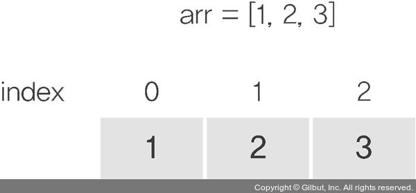
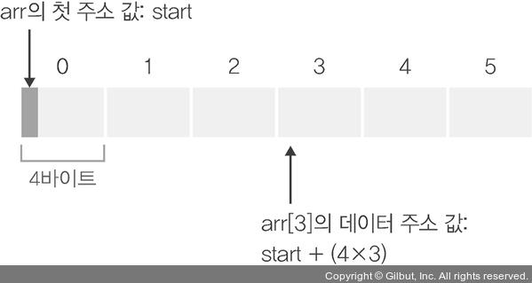
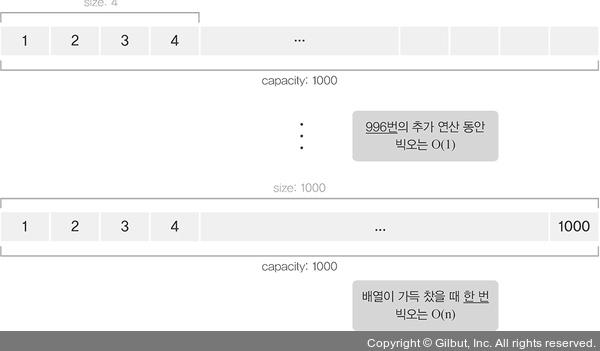
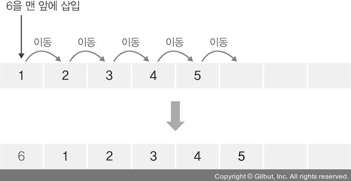

# 동적배열
## 0. 스택과 힙 영역
### 스택 영역: 실제 스택 프레임이 쌓이는 메모리 공간
- 특징: 스택 프레임을 할당하려면 미리 할당될 스택 프레임의 크기를 알고 있어야 함. &rightarrow; 반드시 고정된 크기로 생성- &rarr; 크기가 가변적으로 변할 수 있는 상황에서는 사용이 어려움.
###  힙 영역: 변수의 생성시기과 소멸시기를 프로그래머가 결정할 수 있는 메모리가 동적으로 할당되는 영역
- 특징:프로그래머가 원하는 만큼 크기를 할당받을 수 있으므로  일단 필요한 만큼 할당받아 데이터를 저장하다가, 많은 메모리가 필요한 순간이 오면 더 큰 공간을 확보하여 이전 배열 요소를 모두 복사한 후 새로운 데이터를 삽입하는 것이 가능.

## 1. 동적 배열이란
 <span style="color:green"><br>힙 영역에 저장되</br>는 배열</span>
- ex) C++의 vector, 자바의 ArrayList, 파이썬의 리스트

### 동적 배열의 객체와 연산종류
- Object: 원소의 순서 있는 유한 집합 Array

- Operation
    - Array.is_empty( ) -> Boolean
    : 리스트가 비어 있으면 TRUE, 아니면 FALSE 반환
    - Array.add_last(element)
    :리스트의 마지막에 원소 추가
- Array.append():리스트의 마지막에 원소를 추가
-  Array.insert(index, element)
: 리스트의 index 위치에 element 원소 삽입

4. Array[index] -> element
: 인덱싱(indexing), 인덱스에 위치한 원소 반환

5. Array.pop( ) -> element
: 리스트의 마지막 원소를 삭제한 후 반환

6. Array.pop(index) -> element
: 인덱스에 위치한 원소를 삭제하고 반환
- Array.remove(value):
 리스트 안에있는 값을 삭제함.

## 2. 지역성의 원리와 캐시
(한번 더 읽고 정리하기~)
- 배열의 특징: 메모리상에서 <br>물리적, 선형적</br>으로 이어져 있음


```python
arr=[1,2,3,4,5]
def sum_all(arr):
    ret = 0 # 1
    for elem in arr: # 2
        ret += elem  # 3
    return ret
```
- 시간 지역성(temporal locality):한번 접근한 변수는 계속해서 접근할 가능성이 높다
    - 위의 코드에서 CPU는 for 문이 수행될 때 배열의 모든 요소를 가져오면서 항상 ret 값을 먼저 가져옴.

- 공간 지역성(spatial locality):접근한 변수는 이전에 접근한 변수 근처에 있을 가능성이 높다는 것

- 레지스터 :메인 메모리에서 가져온 데이터를 일시적으로 저장할 수 있는 CPU에 있는 메모리 공간, 메모리 중에서 가장 빠름

## 3. 동적배열에서의 탐색: 인덱싱
- 배열에서 데이터에 접근하는 방법 
- 인덱스는 보통 0부터ㅓ 시작함.
- 데이터 접근 공식 :`데이터 주소 값 = 배열의 첫 주소 값 + (데이터 크기 * 인덱스)`
- 배열의 길이에 상관없이 한번의 연산으로 값에 접근가능 -> `O(1)`


## 4. 동적 배열에서 데이터의 삽입과 삭제
### .1 데이터를 배열의 마지막에 추가하거나 삭제하는 경우
- capacity: 배열이 확보한 메모리공간
- size: 채워진 데이터 크기
#### capacity>size 인경우

- 배열의 길이에 상관없이 무조건 마직막요소 다음에 추가,삭제하면 됨 &rarr; O(1)

 #### capacity < size 인경우(배열이 가득차 있을때)
 - 충분한 공간을 다시 확보하고 기존 배열 요소를 모두 복사한 후 새로운 데이터를 추가해야함.
 - 데이터 개수만큼 복사진행 &rarr; O(n)
 


### .2 배열의 중간에 데이터를 삽입하거나 삭제하는 연산
ex) 요소를 배열의 맨처음에 삽입할시, 이미 있는 요소들을 모두 한 번씩 뒤로 옮긴후 열의 맨 처음에 새로운 요소를 삽입.
: 데이터 개수가 n이라면 모두 n번 복사 &rarr; `O(n)`



